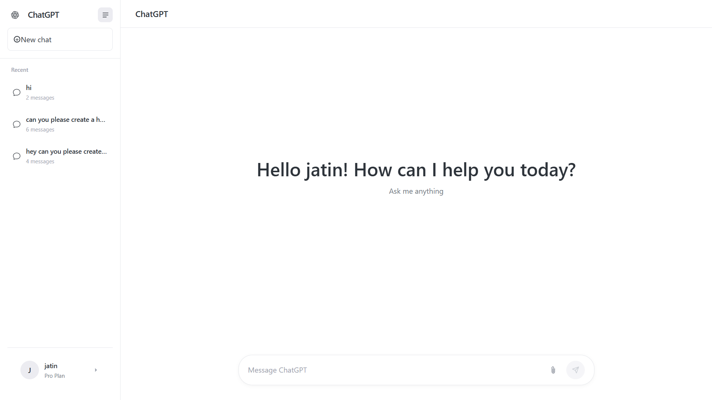

# ChatGPT Clone

A responsive, feature-rich ChatGPT-like interface built with HTML, CSS, and JavaScript. This project mimics the core functionality of ChatGPT with a modern UI, chat history, file attachments, and both simulated and real AI responses via the Gemini API.



## Features

- 🎨 **Modern UI/UX** - Clean, responsive design that works on mobile and desktop
- 💬 **Real-time Chat** - Interactive conversation interface with typing indicators
- 📚 **Chat History** - Save and manage multiple conversation threads
- 📎 **File Attachments** - Support for image and document uploads
- 🤖 **AI Integration** - Connect to Gemini API for real AI responses
- 🌙 **Dark/Light Mode** - Toggle between themes (Ctrl+D)
- 📱 **Responsive Design** - Works on all device sizes
- 🔒 **Client-side Storage** - All data stored locally in your browser

## Getting Started

### Prerequisites

- A modern web browser (Chrome, Firefox, Safari, Edge)
- Optional: [Google AI Studio API Key](https://aistudio.google.com/app/apikey) for real AI responses

### Installation

1. Clone or download this repository:
   ```bash
   git clone https://github.com/jagbiryadav/chatgpt-clone.git
   ```

2. Open `index.html` in your web browser

3. On first launch, you'll be prompted to enter your name and optionally your Gemini API key

### Usage

1. **Starting a Chat**: Enter your message in the input field at the bottom and press Enter or click Send
2. **New Chat**: Click the "New chat" button in the sidebar
3. **Switching Chats**: Click on any previous chat in the sidebar to resume it
4. **Attaching Files**: Click the paperclip icon to upload images or documents
5. **Changing Themes**: Press `Ctrl+D` to toggle between light and dark mode
6. **Managing Chats**: Use the rename and delete buttons on each chat item

## API Integration

This project can work with the Gemini API for real AI responses:

1. Get your free API key from [Google AI Studio](https://aistudio.google.com/app/apikey)
2. Enter your API key in the profile settings or during onboarding
3. The app will automatically use the API for responses

**Note**: Due to browser security restrictions (CORS), direct API calls may not work in all browsers. The app includes a simulated response mode that works without an API key.

## Project Structure

```
chatgpt-clone/
├── index.html          # Main HTML file with all code
├── css/                # Stylesheets
│   ├── root-c1znbk8k.css
│   └── conversation-small-chy8jwv7.css
├── images/             # Favicons and other images
└── README.md           # This file
```

## Key Components

### User Interface
- Responsive sidebar with chat history
- Main chat area with message bubbles
- Message composer with file attachment support
- Profile settings modal
- Onboarding screen

### Core Functionality
- Chat management (create, rename, delete)
- Local storage for chat history and user preferences
- File upload and preview
- Theme switching
- Simulated AI responses

### Technical Features
- Modern CSS with flexbox and grid layouts
- Responsive design with mobile-first approach
- Custom scrollbars and animations
- Accessibility features (keyboard navigation)
- Error handling and user feedback

## Browser Support

- Chrome 60+
- Firefox 55+
- Safari 12+
- Edge 79+

## Customization

You can customize the interface by modifying the CSS variables in the `<style>` section of `index.html`:

```css
:root {
    --sidebar-width: 260px;
    --header-height: 60px;
    --mobile-header-height: 56px;
    --composer-min-height: 120px;
    --max-content-width: 768px;
    /* ... other variables */
}
```

## Development

This project is built with vanilla HTML, CSS, and JavaScript with no external dependencies. All code is contained within a single HTML file for easy deployment.

To modify the project:
1. Edit `index.html` to change the UI or functionality
2. Modify the CSS within the `<style>` tags to change appearance
3. Update the JavaScript code to add new features

## Limitations

1. **CORS Restrictions**: Direct API calls to Gemini may be blocked by browser security policies
2. **Local Storage**: All data is stored in the browser and will be lost if you clear your browser data
3. **File Size Limits**: Large file uploads may not work due to API limitations
4. **Browser Compatibility**: Some features may not work in older browsers

## Contributing

Contributions are welcome! Please feel free to submit a Pull Request.

1. Fork the repository
2. Create your feature branch (`git checkout -b feature/AmazingFeature`)
3. Commit your changes (`git commit -m 'Add some AmazingFeature'`)
4. Push to the branch (`git push origin feature/AmazingFeature`)
5. Open a Pull Request

## License

This project is open source and available under the [MIT License](LICENSE).

## Acknowledgments

- [Google Gemini API](https://ai.google.dev/) for AI capabilities
- [OpenAI](https://openai.com/) for the ChatGPT inspiration
- All contributors and users of this project

## Support

If you encounter any issues or have questions:
1. Check the browser console for error messages
2. Ensure you're using a modern browser
3. Verify your API key is correct (if using Gemini integration)
4. Clear your browser cache and try again

For additional help, please open an issue on GitHub.